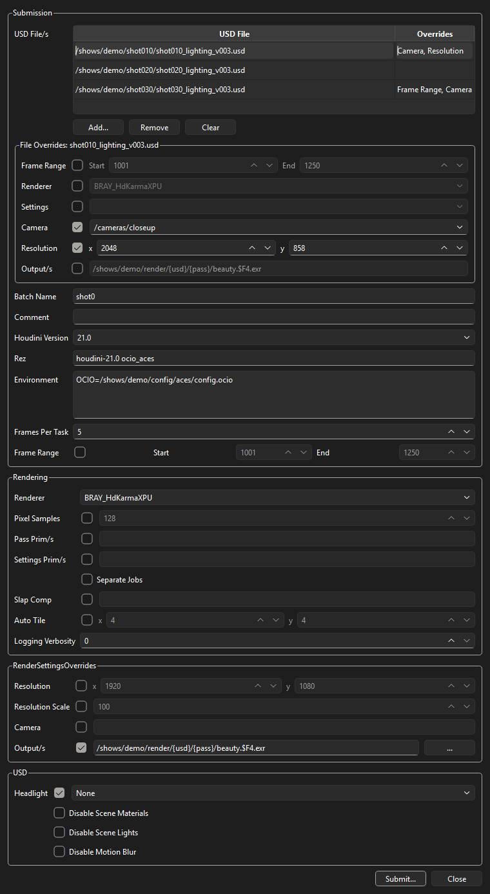
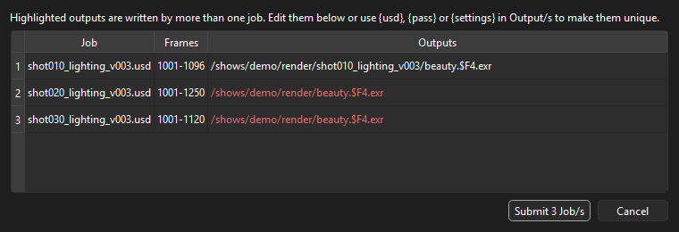

# Husk Standalone Submitter
Submit USD files to [Deadline](https://www.awsthinkbox.com/deadline) as Houdini husk render jobs, from the Deadline Monitor, from inside Houdini or as a standalone app.

## Lineage
This repository is a fork of a fork, and has diverged a lot from both:

1. [DavidTree/HuskStandaloneSubmitter](https://github.com/DavidTree/HuskStandaloneSubmitter): the original husk submitter by David Tree.
2. [pixel-ninja/HuskStandaloneSubmitter](https://github.com/pixel-ninja/HuskStandaloneSubmitter): a 2.0 rewrite by [Matt Tillman - Pixel Ninja](https://pixelninja.design/), adding the HuskStandalone plugin, render pass submission and output file detection.
3. [chordee/HuskStandaloneSubmitter](https://github.com/chordee/HuskStandaloneSubmitter) (this repository): cross-platform and submission fixes, output path tokens, per Houdini version husk executables, and a submitter for Houdini and standalone use.

Thanks to both authors for the work this builds on.

## Components
| Component | Path | Runs in |
|---|---|---|
| Deadline plugin | `HuskStandalone/` | Deadline Worker |
| Monitor submitter | `HuskStandaloneSubmission.py` | Deadline Monitor |
| Houdini / standalone submitter | `python/husk_submitter/`, `houdini/` | Houdini 21+, or Python with PySide6 and `usd-core` |

Both submitters create the same `HuskStandalone` plugin jobs and can be used side by side.

## Features
- Submit multiple USD files, each as one or more jobs
- Frame range from the stage timecodes, or set explicitly
- Renderer selection (Karma XPU, Karma CPU, Redshift) and GPU affinity (Karma XPU, Redshift)
- Render pass submission (`--pass`, Houdini 21+), with pattern matching like `--settings`
- Override render settings, resolution, camera, outputs and more, at submission or later from the Monitor
- Output paths with `{usd}`, `{pass}` and `{settings}` tokens, and warnings when jobs would write the same files
- Overrides per USD file (frame range, renderer, settings, camera, resolution, outputs) and outputs per job (Houdini and standalone submitter)
- Output file names shown in the Monitor, so renders can be browsed from the job
- Husk executable chosen per Houdini version, or rendering in a rez context
- Environment variables for the render
- Path mapping of the input USD and output paths (untested)

## Requirements
- Deadline 10 (tested with 10.4)
- Houdini 21.0 or 22.0. Other versions can be added, see [Adding a Houdini version](#adding-a-houdini-version). Some husk options need newer versions, e.g. `--pass` is Houdini 21+.

## Installation
### 1. Deadline plugin and Monitor submitter
Copy the files to the Deadline repository:

```
HuskStandalone/              > {DeadlineRepository}/custom/plugins/HuskStandalone
HuskStandaloneSubmission.py  > {DeadlineRepository}/custom/scripts/Submission
```

`install.py` does this for you when `deadlinecommand` is on `PATH` and the client connects to the repository directly. With a Remote Connection Server, `deadlinecommand -GetRepositoryPath` returns a URL instead of a path, so copy the files manually.

### 2. Husk executables
In the Deadline Monitor go to **Tools > Configure Plugin > HuskStandalone** and set **Houdini 21.0 Husk Executable** and **Houdini 22.0 Husk Executable** under Render Executables. The defaults are the standard install locations with a `.000` placeholder build, e.g. `C:\Program Files\Side Effects Software\Houdini 21.0.000\bin\husk.exe`. Enter one path per line for alternative locations.

Jobs render with the husk of the Houdini version they were submitted with. The Monitor submitter also uses that version's `usdcat` to read the USD files.

To render in rez contexts, also set **Rez Executable** under Rez to the `rez` executable on the Workers.

### 3. Houdini submitter (optional)
1. Copy `houdini/husk_submitter.json` to a Houdini packages directory, e.g. `$HOUDINI_USER_PREF_DIR/packages`.
2. Edit `HUSK_SUBMITTER` in the copied file to point at this repository.
3. `deadlinecommand` must be found via `DEADLINE_PATH`, the macOS `/Users/Shared/Thinkbox/DEADLINE_PATH` file or `PATH`, which is the case on machines with the Deadline client installed.

## Usage
### Deadline Monitor
Go to **Submit > HuskStandalone**, select USD files, choose the **Houdini Version** and click **Submit**.

From a terminal:

```
deadlinecommand ExecuteScript <path/to/HuskStandaloneSubmission.py> [usd_paths] --modal
```

### Houdini
Add the **Husk Submitter** shelf and click **Submit Husk**, or run from the Python shell:

```python
from husk_submitter import ui
ui.show()
```

USD files are read with Houdini's own `pxr`, so render prims resolve exactly as husk sees them (same USD version, file format plugins and asset resolvers). The running Houdini version is written to the jobs.

### Standalone
The same dialog runs outside Houdini with [uv](https://docs.astral.sh/uv/). Run from the repository root:

```
uv sync --group ui
PYTHONPATH=python uv run python -m husk_submitter.ui [usd_paths]
```

In PowerShell, set the variable first with `$env:PYTHONPATH = "python"`. USD files are read with `usd-core`, so custom asset resolvers or file format plugins from Houdini are not available. Choose the **Houdini Version** in the dialog.



### Rez and environment variables
All submitters have **Rez** and **Environment** settings, shared by every job and remembered for the next submission.

- **Rez** renders with the husk of a rez context instead of the Houdini Version's husk: the Worker runs `rez env <request> -- husk ...` for a package request such as `houdini-21.0 ocio_aces`, or `rez env --input <file> -- husk ...` for a context file (`.rxt`). husk must be on the context's `PATH`, and the Workers need access to the rez packages. Inside Houdini started from rez, it defaults to the current context's request (`REZ_USED_REQUEST`).
- **Environment** sets environment variables when rendering, one `KEY=VALUE` per line. They can be changed after submission in the job's Environment properties in the Monitor.

### File overrides
In the Houdini or standalone dialog, select one or more USD files to override the shared settings for those files in **File Overrides**: Frame Range, Renderer, Settings, Camera, Resolution and Output/s. Enabled rows replace the shared setting for every job of the file, and the **Overrides** column lists what each file overrides.

- Settings and Camera list the file's RenderSettings and camera prims. They can be typed too: Settings accepts the same list and `*` wildcards as the shared setting, and cameras inside payloads aren't listed.
- With several files selected, the first file's overrides are shown and a changed row is applied to all of them. Other rows keep each file's own overrides.
- Blank Settings, Camera and Output/s overrides use the shared setting.

### Reviewing jobs
Clicking **Submit...** lists the jobs to be submitted with their outputs before anything is sent. Output paths written by more than one job are highlighted. Double-click a job's outputs to set them for that job only: a comma separated list with one path per RenderProduct, in which `{usd}`, `{pass}` and `{settings}` are expanded.



## How outputs are determined
`--pass`, `--settings` and `--output` together decide what is rendered and where:

- A RenderPass drives its RenderSettings through `renderSource`.
- RenderSettings drive their RenderProducts, and each RenderProduct's `productName` is an output file.
- Without a pass or settings override, the stage's `renderSettingsPrimPath` is used.

The submitters resolve this chain, but the plugin does not. Changing `--pass`, `--settings` or `--output` after submission in **Modify Job Properties** does not update the others.

### Passes and settings
`--pass` works like `--settings` rather than husk's own option: several passes can be given as a comma or space separated list, by prim name or path, with `*` wildcards. Each pass is submitted as its own job, and **Separate Jobs** also splits each RenderSettings prim into its own job.

The Houdini submitter matches patterns against prim names, paths below `/Render` or absolute paths, and reports a pattern that matches nothing instead of falling back to the default settings.

### Output overrides
With **Output/s** enabled, the given paths replace the RenderProducts' `productName`, so it doesn't matter whether `productName` is time sampled. Keep in mind that:

- `--output` maps to RenderProducts by position. List one path per product, otherwise the remaining products keep their `productName`.
- The paths apply to every job. Use `{usd}`, `{pass}` or `{settings}` to keep jobs from writing the same files.
- Husk expands frame variables such as `$F4`, `<F4>` or `%04d`, but the Monitor may not recognise `$F` when browsing outputs.

## Adding a Houdini version
1. Add a `Houdini<major>_<minor>_Husk_Executable` entry to `HuskStandalone/HuskStandalone.param`.
2. Add the version to `HOUDINI_VERSIONS` in `HuskStandaloneSubmission.py` and `python/husk_submitter/options.py`.

## Development
The submitter core (`python/husk_submitter`: `render_info`, `jobs`, `deadline`, `options`) only depends on `pxr` and runs outside Houdini. Tests use uv with `usd-core`:

```
uv run pytest
uv sync --group ui && uv run pytest   # also run the dialog tests (PySide6)
```

The husk arguments of the Houdini submitter are defined once in `python/husk_submitter/options.py`. After changing them, regenerate the plugin options file:

```
PYTHONPATH=python uv run python -m husk_submitter.options HuskStandalone/HuskStandalone.options
```

The Monitor submitter defines its controls in the `CONTROLS` variable, which can be reordered to rearrange its UI. It can regenerate the options file too:

```
deadlinecommand ExecuteScript <path/to/HuskStandaloneSubmission.py> --generate-options
```

The Monitor submitter parses `usdcat` output instead of using the USD Python bindings, as Deadline's Python can't import the USD shipped with Houdini.

## License
[GPL-3.0](LICENSE)
